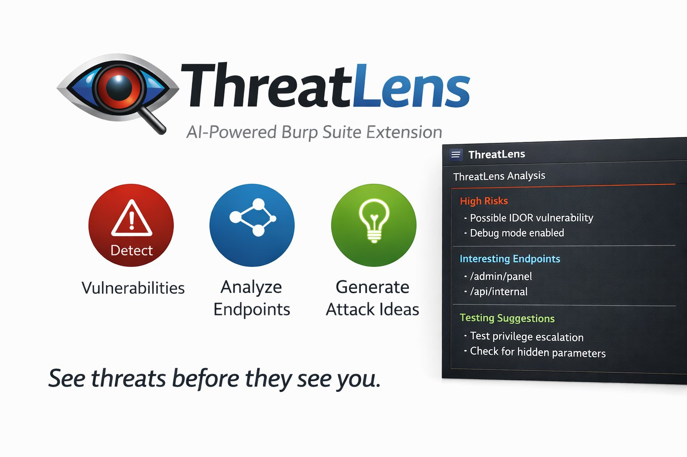

<div align="center">



# ThreatLens

**AI-Powered Burp Suite Extension**

*See threats before they see you.*

[](https://opensource.org/licenses/MIT)
[](https://www.python.org/)
[](https://portswigger.net/burp)
[](https://openai.com/)


</div>

---

## 🔍 Overview

**ThreatLens** automatically analyzes HTTP responses during security assessments and provides actionable vulnerability findings, sensitive data exposure alerts, and attack recommendations using OpenAI's GPT models.

### Key Capabilities

- **Detect Vulnerabilities** - IDOR, injection, auth bypass, data exposure
- **Analyze Endpoints** - Hidden APIs, admin panels, debug endpoints  
- **Generate Attack Ideas** - Specific payloads and exploitation techniques

---

## 📺 Demo

```
[10:45:23] 🔴 2 HIGH - https://api.example.com/orders/12345

[HIGH] IDOR Vulnerability - Predictable Order IDs
Payload: GET /api/orders/12346, /orders/12347
Impact: Access to all customer PII, addresses, payment info

[HIGH] Sensitive Internal Data Exposure  
Response contains: "internal_notes", "fulfillment_center"
Impact: Business processes revealed
```

*ThreatLens automatically categorizes findings and provides specific attack payloads.*

---

## ✨ Features

- 🔍 **Real-time Analysis** - Analyzes HTTP responses as you browse
- 🎯 **Smart Detection** - Finds IDOR, injection, auth bypass, data exposure
- 💰 **Cost Optimized** - Filters reduce API costs by 80%
- 📊 **Severity Levels** - Categorizes findings (High/Medium/Low)
- ⚡ **Async Processing** - Non-blocking, fast analysis
- 📤 **Export Reports** - JSON export for documentation
- 🎨 **Custom UI** - Dedicated Burp Suite tab
- 🔧 **Configurable** - Multiple filters and AI models

---

## 📑 Table of Contents

- [Quick Start](#-quick-start)
- [Installation](#-installation)
- [Configuration](#-configuration)
- [Usage Examples](#-usage-examples)
- [Documentation](#-documentation)
- [Cost Management](#-cost-management)
- [Troubleshooting](#-troubleshooting)
- [Contributing](#-contributing)
- [License](#-license)

---

## 🚀 Quick Start

**3 simple steps to get started:**

### 1️⃣ Run Setup Script

```bash
# Linux/macOS
cd setup && chmod +x setup.sh && ./setup.sh

# Windows
cd setup && setup.bat
```

### 2️⃣ Load in Burp Suite

1. **Extensions** → **Extension Settings** → Set Jython path
2. **Extensions** → **Installed** → **Add** → Select `ai_recon_assistant.py`
3. Look for "ThreatLens loaded successfully!" message

### 3️⃣ Configure API Key

1. Click **ThreatLens** tab in Burp
2. Enter your [OpenAI API key](https://platform.openai.com/api-keys)
3. Click **Save Configuration**

**You're ready!** Start browsing a web application and watch the AI analyze responses in real-time.

---

---

## 🔧 Installation

### Prerequisites
- ✅ Burp Suite Pro or Community Edition
- ✅ OpenAI API key (get from https://platform.openai.com/api-keys)
- ✅ Jython standalone JAR (for Python extensions)

### Installation Steps

#### 1. Download Jython

```bash
# Download Jython 2.7.3 standalone
wget https://repo1.maven.org/maven2/org/python/jython-standalone/2.7.3/jython-standalone-2.7.3.jar
# Or download from: https://www.jython.org/download
```

#### 2. Configure Burp Suite

1. Open Burp Suite
2. Go to **Extensions** → **Extension Settings**
3. Under **Python Environment**, set:
   - Location of Jython standalone JAR: `/path/to/jython-standalone-2.7.3.jar`
4. Click **Select file** and choose the downloaded JAR

#### 3. Load the Extension

1. Go to **Extensions** → **Installed**
2. Click **Add**
3. Extension type: **Python**
4. Extension file: Select `ai_recon_assistant.py`
5. Click **Next**

You should see: ✅ "AI Recon Assistant loaded successfully!"

#### 4. Configure API Key

1. Click on the **AI Recon** tab in Burp
2. Enter your OpenAI API key
3. Configure filters (recommended settings for pen-testing):
   - ✅ Analysis Enabled
   - ✅ Filter by Content-Type (saves API costs)
   - ✅ Filter by Status (only 2xx responses)
4. Click **Save Configuration**

---

## 💡 Usage Examples

### Example 1: API Endpoint Testing

**Target**: `https://api.shop.com/users/123`

**AI Analysis**:
```
[HIGH] IDOR Vulnerability Detected
- Test user enumeration: /users/124, /users/125
- Check authorization on other user IDs
- Payload: Change user_id parameter

[MEDIUM] Sensitive Data Exposure
- Response contains: email, phone, address
- No rate limiting detected
```

### Example 2: Authentication Testing

**Target**: `https://auth.example.com/login`

**AI Analysis**:
```
[HIGH] JWT Contains Exploitable Claims
- Modify: "role": "admin", "is_admin": true
- Test with algorithm confusion (alg: none)
- Impact: Privilege escalation
```

### Example 3: GraphQL Analysis

**Target**: `https://api.example.com/graphql`

**AI Analysis**:
```
[HIGH] GraphQL Introspection Enabled
- Full schema exposed
- Sensitive fields: password_hash, admin_secret_token
- Impact: Complete API mapping
```

---

## 📚 Documentation

- **[Usage Guide](docs/USAGE_GUIDE.md)** - Real-world penetration testing scenarios
- **[Examples & Troubleshooting](docs/EXAMPLES_AND_TROUBLESHOOTING.md)** - Sample outputs and common issues
- **[Project Overview](docs/PROJECT_OVERVIEW.md)** - Technical details and CV-ready descriptions

---

## 🎯 How It Works

### Smart Filtering (Cost-Effective)

The extension automatically filters responses to analyze only valuable targets:

- **Content-Type Filter**: Only analyzes JSON/XML/API responses
- **Status Filter**: Only analyzes successful responses (200-299)
- **Size Filter**: Skips tiny responses (<100 bytes) and truncates large ones (>10KB)

This saves 80-90% on API costs by ignoring HTML pages, images, CSS, etc.

### Analysis Pipeline

```
HTTP Response → Filter → Clean → AI Analysis → Display
```

1. **Capture**: Intercepts all HTTP responses
2. **Filter**: Applies smart filters to identify interesting responses
3. **Clean**: Extracts JSON, removes noise, truncates size
4. **Analyze**: Sends cleaned data to OpenAI with security-focused prompt
5. **Display**: Shows findings in the AI Recon tab

### What It Detects

**🔴 High Severity:**
- IDOR vulnerabilities
- Authentication bypasses
- SQL/Command injection vectors
- Exposed credentials/tokens

**🟡 Medium Severity:**
- Sensitive data exposure (PII, internal paths)
- Missing security headers
- Information disclosure
- Interesting API endpoints

**Attack Ideas:**
- Specific payloads to test
- Parameter manipulation techniques
- Authorization bypass methods

---

## 💡 Usage Examples

### Example 1: API Endpoint Discovery

**Target**: `https://api.example.com/users/123`

**AI Analysis Output:**
```
[HIGH] Potential IDOR Vulnerability
- Test user enumeration: /users/124, /users/125
- Check authorization on other user IDs
- Payload: Change user_id parameter

[MEDIUM] Sensitive Data Exposure
- Response contains: email, phone, address
- No rate limiting detected
- Consider testing mass enumeration

[ATTACK] Authorization Bypass
- Try: /users/123?admin=true
- Test: X-User-Role: admin header
```

### Example 2: Admin Panel Detection

**Target**: `https://example.com/api/config`

**AI Analysis Output:**
```
[HIGH] Debug Endpoint Exposed
- Path reveals: /api/internal/admin
- Database credentials in response
- Attack: Access internal APIs directly

[MEDIUM] Security Headers Missing
- No X-Frame-Options
- No Content-Security-Policy
- Clickjacking possible
```

---

## ⚙️ Configuration Guide

### Optimal Settings for Pen-Testing

```
✅ Analysis Enabled: ON
✅ Filter by Content-Type: ON (saves API costs)
✅ Filter by Status: ON (focus on successful responses)
```

### When to Disable Filters

**Scenario 1**: Testing error pages
- Disable "Filter by Status" to analyze 4xx/5xx responses
- Useful for finding stack traces, debug info

**Scenario 2**: Analyzing all responses
- Disable both filters for comprehensive analysis
- Warning: High API costs!

### API Cost Management

**Model Used**: `gpt-4o-mini` (cost-effective)
- ~$0.15 per 1M input tokens
- ~$0.60 per 1M output tokens

**Estimated Costs**:
- Small assessment (100 requests): ~$0.10
- Medium assessment (1000 requests): ~$1.00
- Large assessment (10000 requests): ~$10.00

**Cost Optimization**:
1. Keep filters enabled
2. Only enable for specific targets (scope)
3. Use during focused testing, not passive scanning

---

## 🔧 Troubleshooting

### Extension Won't Load

**Issue**: "Failed to load extension"

**Solutions**:
1. Check Jython path is correct
2. Verify Python file has no syntax errors
3. Check Burp console (Extensions → Errors) for details

### No Analysis Appearing

**Issue**: Responses not being analyzed

**Checklist**:
- ✅ API key configured correctly
- ✅ "Analysis Enabled" checkbox is checked
- ✅ Responses match filter criteria (JSON, 2xx status)
- ✅ Response size > 100 bytes

**Debug**: Check Burp console for error messages

### API Errors

**Issue**: "API Error: 401 Unauthorized"

**Solution**: Invalid API key - get new key from OpenAI dashboard

**Issue**: "API Error: 429 Rate Limit"

**Solution**: You've hit OpenAI rate limits - wait or upgrade plan

**Issue**: "API Error: Timeout"

**Solution**: Large response or slow network - increase timeout in code

---

## 🎨 Customization

### Modify Analysis Prompt

Edit the `call_openai` function to customize what the AI looks for:

```python
prompt = """You are a penetration tester.

Focus on:
1. SQL injection
2. XSS vulnerabilities
3. Authentication issues

Response:
{}
"""
```

### Change Model

For better analysis (higher cost):
```python
"model": "gpt-4o",  # More accurate, higher cost
```

For faster/cheaper:
```python
"model": "gpt-4o-mini",  # Current default
```

### Add Custom Filters

```python
def should_analyze(self, status_code, headers):
    # Only analyze specific domains
    if 'api.target.com' not in url:
        return False
    
    # Only analyze during specific hours
    current_hour = time.localtime().tm_hour
    if current_hour < 9 or current_hour > 17:
        return False
    
    return True
```

---

## 📊 Output Format

### Reading the Results

```
[SEVERITY] Finding Category
- Specific attack vector
- Payload to test
- Expected behavior
```

**Severity Levels**:
- `[HIGH]` - Immediate security risk, test now
- `[MEDIUM]` - Potential issue, investigate further
- `[INFO]` - Interesting finding, context-dependent

---

## 🚨 Security Considerations

### API Key Protection

⚠️ **Never commit your API key to version control**

The extension stores the key in memory only (not saved to disk).

### Responsible Use

This tool is for **authorized security testing only**.

- ✅ Only use on systems you have permission to test
- ✅ Follow rules of engagement
- ✅ Document findings properly

### Data Privacy

**What gets sent to OpenAI**:
- URL
- HTTP headers
- Response body (truncated)

**Not sent**:
- Your Burp project file
- Other requests/responses
- Personal information (unless in response)

---

## 🎓 Tips for Pen-Testing

### 1. Focus Your Scope

Enable analysis only when browsing target endpoints:
- API routes: `/api/*`, `/v1/*`
- Admin panels: `/admin/*`, `/dashboard/*`
- User endpoints: `/users/*`, `/profile/*`

### 2. Combine with Manual Testing

Use AI findings as starting points:
1. AI suggests IDOR → Test with Burp Repeater
2. AI finds endpoint → Add to Site Map
3. AI recommends payload → Test in Intruder

### 3. Validate Findings

AI can hallucinate - always verify:
- Test suggested payloads manually
- Check if endpoints actually exist
- Confirm vulnerabilities are exploitable

### 4. Save Important Findings

Copy interesting analyses to your notes:
1. Right-click in output area
2. Select text
3. Copy to testing documentation

---

## 📝 Changelog

**v1.0** - Initial Release
- Core HTTP response analysis
- OpenAI integration
- Smart filtering
- Custom UI tab
- Real-time analysis

---

## 🤝 Contributing

Ideas for improvements:
- [ ] Export findings to JSON/CSV
- [ ] Integrate with Burp Scanner
- [ ] Add custom wordlists for endpoint discovery
- [ ] Support for other AI models (Claude, Gemini)
- [ ] Automatic payload generation
- [ ] Severity-based highlighting

---

## 📄 License

This tool is for educational and authorized security testing only.

---

## 🎯 Next Steps

1. ✅ Install Jython
2. ✅ Load extension in Burp
3. ✅ Configure API key
4. ✅ Test on a sample API
5. ✅ Start pen-testing!

**Happy Hunting! 🎯**

---

## 🤝 Contributing

Contributions are welcome! Please see [CONTRIBUTING.md](CONTRIBUTING.md) for guidelines.

**Areas we need help with:**
- Reducing false positives
- Supporting additional AI models (Claude, Gemini)
- Performance optimizations
- Export formats (CSV, PDF)
- Integration with Burp Scanner

---

## 📄 License

This project is licensed under the MIT License - see [LICENSE](LICENSE) for details.

**⚠️ Important**: This tool is for authorized security testing only. Users must have explicit permission to test target systems. See LICENSE for full disclaimer.

---

## 🌟 Show Your Support

If this tool helped you in your security assessments:
- ⭐ Star this repository
- 🐛 Report bugs and issues
- 💡 Suggest new features
- 🔀 Submit pull requests
- 📢 Share with the community

---

## 🙏 Acknowledgments

- Built on the excellent [Burp Suite Extender API](https://portswigger.net/burp/extender)
- Powered by [OpenAI GPT models](https://openai.com/)
- Inspired by the security research community

---

## 📬 Contact & Support

- **Issues**: [GitHub Issues](https://github.com/sonuoffsec/threatlens/issues)
- **Discussions**: [GitHub Discussions](https://github.com/sonuoffsec/threatlens/discussions)
- **Security**: See [CONTRIBUTING.md](CONTRIBUTING.md) for responsible disclosure

---

<div align="center">

**Made with ❤️ for the security community**

[](https://github.com/sonuoffsec/threatlens)
[](https://github.com/sonuoffsec/threatlens)

[⬆ Back to Top](#threatlens)

</div>

---

## 💬 Support

If you encounter issues:
1. Check Burp console for errors
2. Verify API key is valid
3. Test with a simple JSON endpoint first
4. Check OpenAI API status

For advanced customization or questions, refer to:
- Burp Extender API docs
- OpenAI API documentation
